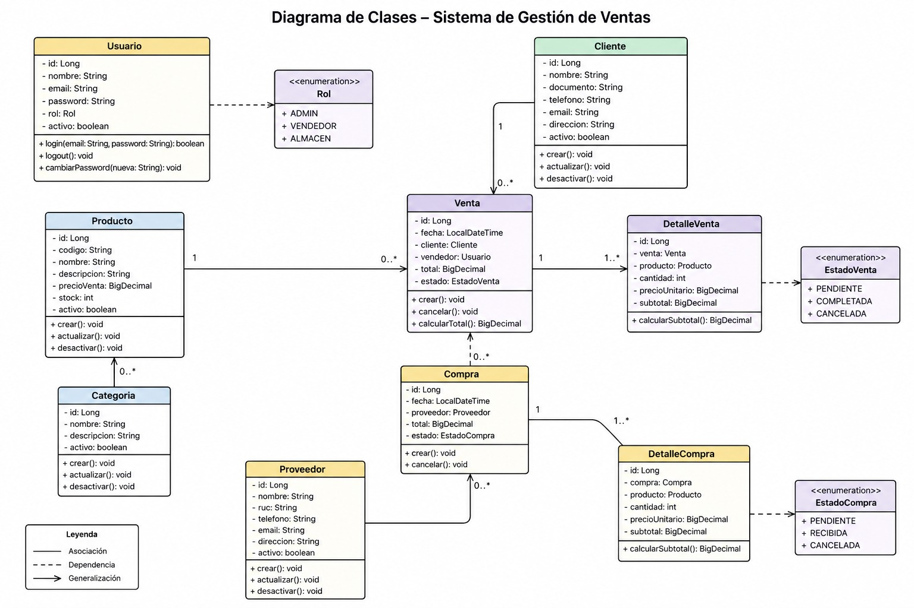

# Sistema de Gestión de Ventas

Proyecto de consola en Node.js para la gestión de ventas, compras, stock y usuarios mediante arquitectura por capas.

---

## Integrantes
- Fabrizio Liberatore
- Luis Baigorri
- Sabrina Neyra

---

## Fecha
03/06/2026

---

## Tecnologías utilizadas
- Node.js
- JavaScript
- Git / GitHub

---

## Estructura del proyecto

proyecto-ventas/
│
├── index.js
├── assets/
│   └── images/
│       └── imagen.jpg
└── src/
    ├── models/
    ├── enums/
    ├── services/
    └── data/

---

## Arquitectura

El sistema está dividido en capas:

- **Models** → Entidades del sistema (Usuario, Producto, Venta, etc.)
- **Enums** → Estados y roles.
- **Services** → Lógica de negocio (ventas, compras, stock).
- **Data** → Datos simulados.

---

##Imagen del sistema



---

## ▶️ Ejecución

```bash
node index.js
```